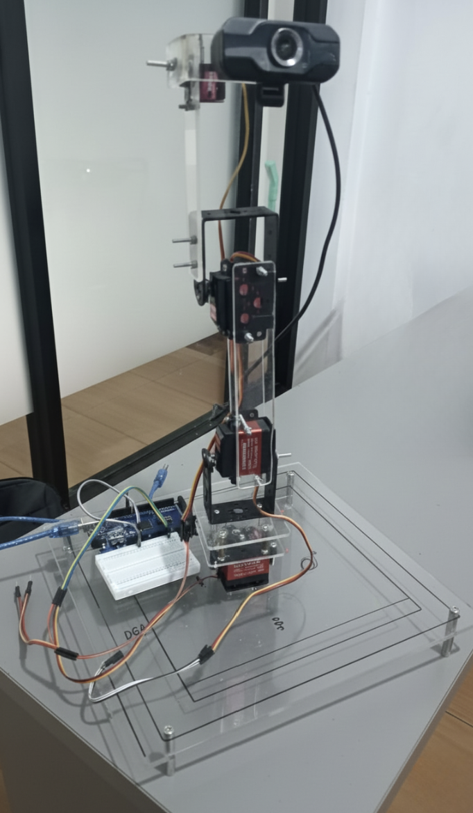

# 4-DOF Face Tracking Robot Arm



This project implements a face-tracking robot arm using a combination of Python (OpenCV) for face detection and Arduino for servo control. The system continuously tracks a person's face through a webcam and adjusts the servo motor to follow the face's movement along the X-axis.

## Features
- Real-time face detection using OpenCV Haar Cascades.
- Serial communication between Python and Arduino.
- Smooth servo motor movement for face tracking.

## Hardware Requirements
- Arduino board
- Servo Motor
- Webcam
- Jumper wires and robot arm hardware/chassis setup

## Software Requirements
- Python 3.x
- Arduino IDE
- Python Packages:
  - `opencv-python`
  - `pyserial`

## Installation & Setup

### 1. Arduino Setup
1. Open `ArduinoRobotArm.ino` in the Arduino IDE.
2. Connect your Arduino board to your computer.
3. Upload the code to the Arduino board.
4. **Important**: Note the COM port your Arduino is connected to (e.g., `COM4`).

### 2. Python Setup
1. Ensure your webcam is connected.
2. Install the required Python libraries using pip:
   ```bash
   pip install opencv-python pyserial
   ```
3. Open `PycharmRobotArm.py`.
4. Update the COM port on line 19 if your Arduino is connected to a different port:
   ```python
   arduino = serial.Serial('COM4', 9600, timeout=1)
   ```
5. Run the Python script:
   ```bash
   python PycharmRobotArm.py
   ```

## How It Works
1. **Python Script**: Captures frames from the webcam, converts them to grayscale, and uses Haar Cascades to detect faces. It calculates the center of the largest detected face, maps it to an appropriate value, and sends it to the Arduino via a Serial connection.
2. **Arduino Code**: Listens for incoming serial data (format: `x,area`), parses it to determine the relative target position for the X-axis servo, and smoothly moves the servo to keep the face in the center of the frame.
3. If no face is detected, the robot arm resets to its neutral position (90 degrees).

## Controls
- Press `q` in the OpenCV face tracking window to stop tracking and exit the Python script.
